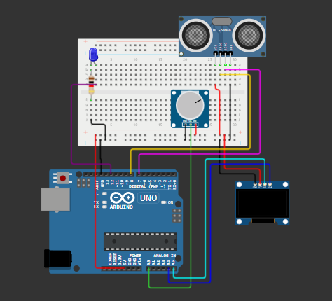
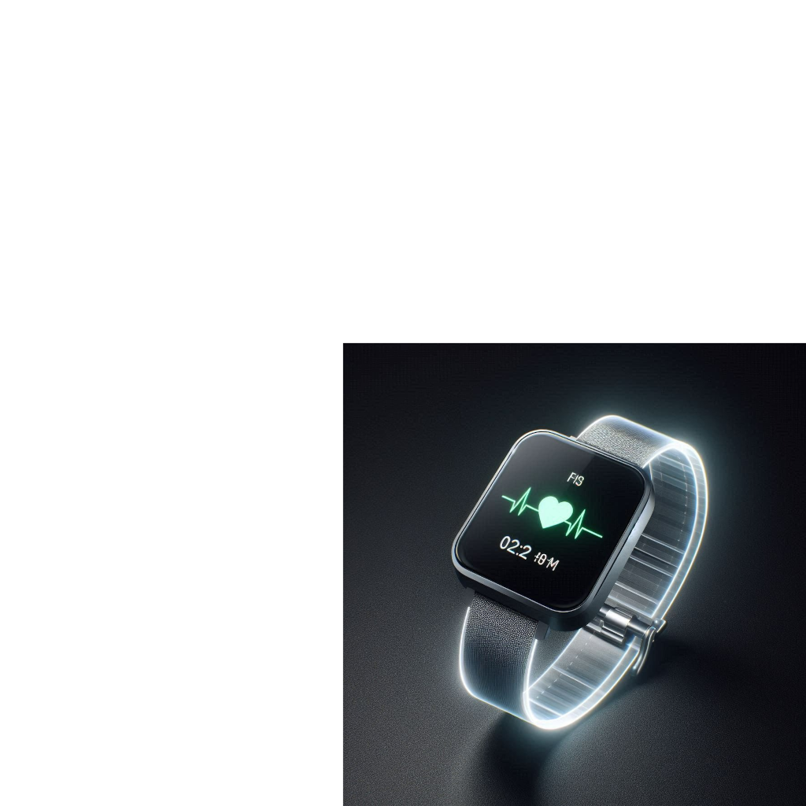

# 💻 Projeto Monitoramento de Batimento Cardíaco 

Este projeto busca medir os batimentos cardiacos do público que estiver assistindo a fórmula E 
ao vivo, através da criação de um relógio. A partir disso, as pessoas poderão ver seus próprios 
batimentos pela tela do relógio e, além disso, será feito o tratamento de todos os dados coletados para 
apresentar no site da SustenRace. Com isso, demostrariamos que, contrário ao que é falado, 
a fórmula E trás muita emoção para quem assiste.

## 📃 Descrição Geral
O projeto é composto por dois principais componentes:

**1. Monitor de Batimento Cardíaco:**

- Usa um potenciômetro para simular a leitura de batimentos cardíacos.
- Exibe os batimentos em um display OLED de 128x64 pixels.
- Exibe batimento cardíaco em tempo real no display.

**2. Sensor Ultrassônico:**

- Utiliza um sensor ultrassônico para medir a distância.

- Acende um LED se a distância medida for menor que 300 cm.

## ⛏️ Componentes Utilizados
- Arduino Uno R3

- Display OLED 128x64 pixels (com driver SSD1306).

- Sensor Ultrassônico (HC-SR04).

- Potenciômetro.

- LED.

- Resistores.

- Jumpers e Protoboard.

## 🛠️ Como montar o projeto
**Conexão do Sensor Ultrassônico**

| Pino Sensor	        | Pino Arduino                                  |
| ------------------- | --------------------------------------------- |
| VCC                 | 5V                                            |
| GND                 | GND                                           |
| TRIG                | 8                                             |
| ECHO                | 7                                             |

**Conexão do Potenciômetro**

| Pino Potenciômetro	| Pino Arduino                                      |
| ------------------- | ------------------------------------------------- |
| VCC                 | 5V                                                |
| GND                 | GND                                               |
| Sinal               | A0                                                |

**Conexão do Display OLED**     

| Pino OLED         | Pino Arduino                                                   |
| ----------------- | -------------------------------------------------------------- |
| VCC               | Arduino Uno R3                                                 |
| GND               | LDR (Fotorresistor)                                            |
| SCL               | A5                                                             |
| SDA               | A4                                                             |
                    
**Conexão do LED**    

| Pino LED          | Pino Arduino                                                     |
| ----------------- | ---------------------------------------------------------------- |
| Anodo (+)	        | 12                                                               |
| Catodo (-)	      | GND                                                              |       

## 🖥️ Requisitos de Software

- Biblioteca U8glib: Para controlar o display OLED.

## 👩‍💻 Como Executar

**1. Montar o Circuito:** Conecte os componentes conforme descrito na seção de **Como montar o projeto**

**2. Carregar o Código:** Use a IDE do Arduino ou utilize uma plataforma online como wokwi.

**3. Executar:** Após o upload, observe o batimento cardíaco simulado no display OLED e a resposta do LED ao sensor ultrassônico. 

## 🖼️ Foto do projeto

 

## ⌚ Protótipo do projeto

## 📞 Contato
Para mais informações ou dúvidas, entre em contato:

- [@AliAndrea1](https://github.com/AliAndrea1)

- [@brunacostaz](https://github.com/brunacostaz)

- [@Laurasdc](https://github.com/Laurasdc)

- [@querenprates](https://github.com/querenprates)

- [@sofiafernandes857](https://github.com/sofiafernandes857)

**💚 SustenRace: Emoção sem prejudicar o planeta.**
